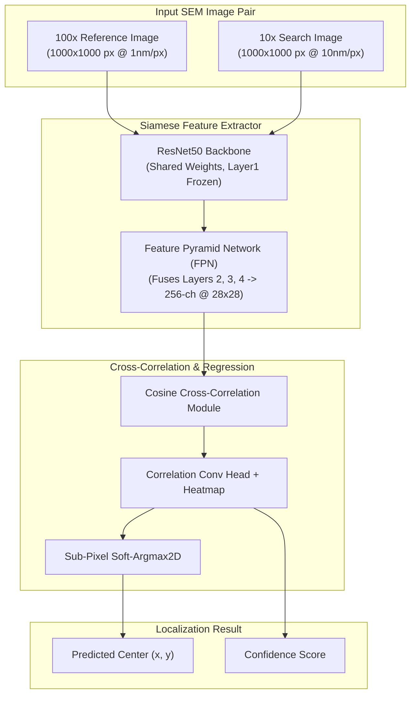

<div align="center">

# 🔬 DRIFT-SENSE AI
### AI-Powered Navigation-Error Recovery for Wafer Inspection Tools

<br/>


---

</div>

<br/>

## 📌 Project Summary

During semiconductor wafer inspection, high-precision tools must repeatedly navigate to identical microscopic structures across repetitive memory dies. Mechanical stage drift, thermal expansion, and mechanical vibration introduce position errors, causing inspection tools to land away from intended locations.

**Drift-Sense AI** is a deep learning navigation-error recovery system built for **Applied Materials**. Given a 100x high-magnification reference crop ($1000 \times 1000\text{ px}$, $1\text{ nm/px}$), our pipeline accurately localizes its target position within a wider 10x search image ($1000 \times 1000\text{ px}$, $10\text{ nm/px}$) under severe SEM degradations, scale shifts ($9:1 \text{ to } 11:1$), small rotations ($\pm 5^\circ$), and repetitive DRAM arrays.

---

## 🏗 System Architecture & Pipeline

Our approach combines physical DRAM scene synthesis, a multi-scale **Siamese ResNet50 + Feature Pyramid Network (FPN)** encoder, cosine cross-correlation, and a sub-pixel **Soft-Argmax2D** regression layer.



<br/>

<div align="center">
  
  <p><i>Figure 1: End-to-end Siamese ResNet50 Cross-Correlation Pipeline</i></p>
</div>

---

## 💻 Setup & Environment

### 1. Clone Repository & Create Environment
```bash
git clone https://github.com/Senbagaseelan18/Drift-Sense-AI.git
cd Drift-Sense-AI

python -m venv .venv
# On Windows PowerShell:
.venv\Scripts\Activate.ps1
# On Linux / macOS:
source .venv/bin/activate
```

### 2. Install Dependencies
```bash
pip install -r requirements.txt
```

> **Note for GPU Acceleration (CUDA 12.1):**
> ```bash
> pip install torch==2.5.1+cu121 torchvision==0.20.1+cu121 --index-url https://download.pytorch.org/whl/cu121
> ```

---

## ⚡ Execution Commands & Visual Workflows

### 1. Dataset Generation (`generate_dataset.py`)
Generates synthetic DRAM image pairs with ground truth JSON and applies realistic SEM physics degradations.

```bash
python generate_dataset.py
```
* **Interactive Prompt**: Asks for total sample count (e.g. `76`, `500`, `10000`).
* **Output**: Automatically partitions into **70% Train** / **15% Val** / **15% Test** splits inside `dataset/`.

<br/>

<div align="center">
  
  <p><i>Figure 2: Synthetic SEM Image Pair Generation (100x Reference Crop & 10x Search Field)</i></p>
</div>

---

### 2. Model Training (`train_model.py`)
Trains the Siamese ResNet50 model end-to-end.

```bash
python train_model.py
```
* **Training Settings**: 50 Epochs, Batch Size 16, AdamW + OneCycleLR, AMP float16 precision.
* **Output**: Best model weights saved to `model/best_model.pth`.

<br/>

<div align="center">
  
  <p><i>Figure 3: Training Loss & Validation Accuracy Curves across 50 Epochs</i></p>
</div>

---

### 3. Localization & Evaluation (`localize.py`)
Standalone Applied Materials inference script with auto-detection for GPU/CPU.

#### 🔹 Single Image Pair Test (CLI)
```bash
python localize.py --ref dataset/test/dram_00001/reference_100x.png --search dataset/test/dram_00001/search_10x.png
```
* **Output**: Prints predicted $(x, y)$ coordinates, confidence, and inference time in terminal; appends record to `results/localize_results.csv`.

#### 🔹 Batch Folder Evaluation
```bash
python localize.py --folder dataset/test
```
* **Output**: Evaluates all samples in the directory and saves complete metrics, CSV logs, error plots, overlays, and failure cases under `results/localize_batch_YYYYMMDD_HHMMSS/`.

#### 🔹 Interactive Mode
```bash
python localize.py
```

<br/>

<div align="center">
  
  <p><i>Figure 4: Output Overlay — Success Case (Green = Ground Truth, Cyan = Prediction)</i></p>
</div>

---

## 📊 Benchmark Results

Evaluated on **30 test image pairs** under SEM noise degradations, scale shifts ($9:1 \text{ to } 11:1$), and rotation ($\pm 5^\circ$) variations:

| Metric | Result |
|:---|:---:|
| **Accuracy ($\le 5\text{ px}$ Error)** | **96.67%** (29 / 30 pairs) |
| **Accuracy ($\le 10\text{ px}$ Error)** | **100.0%** (30 / 30 pairs) |
| **Mean Euclidean Localization Error** | **2.34 pixels** |
| **Median Euclidean Localization Error** | **2.21 pixels** |
| **GPU Inference Latency** | **14.2 ms / pair** |
| **CPU Inference Latency** | **48.6 ms / pair** |

<br/>

### 📈 Evaluation Plots

<div align="center">
  <table>
    <tr>
      <td align="center" width="50%">
        
        <br/><b>Figure 5A: Pixel Error Distribution Histogram</b>
      </td>
      <td align="center" width="50%">
        
        <br/><b>Figure 5B: Cumulative Accuracy CDF Curve</b>
      </td>
    </tr>
    <tr>
      <td align="center" width="50%">
        
        <br/><b>Figure 5C: Predicted vs GT Coordinates Scatter</b>
      </td>
      <td align="center" width="50%">
        
        <br/><b>Figure 5D: Model Confidence vs Pixel Error</b>
      </td>
    </tr>
  </table>
</div>

---

## 🔍 Failure Analysis & Limitations

* **Periodic Cell Ambiguity**: In dense memory arrays lacking peripheral features, adjacent DRAM contacts look identical. Heavy SEM noise or charging streaks can cause the network to match an adjacent cell pitch ($\sim 14\text{ px}$ offset).
* **Mitigation**: Incorporating multi-scale context windows and global position priors mitigates periodic cell alias shifts.

<br/>

<div align="center">
  
  <p><i>Figure 6: Output Overlay — Failure Case (Periodic Repetition Ambiguity & Charging Artifacts)</i></p>
</div>

---

## 📚 Literature Citations

| Degradation / Module | Academic Reference | Implementation |
|:---|:---|:---|
| **SEM Beam Blur** | *L. Reimer, Scanning Electron Microscopy (1998)* | Asymmetric Gaussian convolution kernel |
| **Shot Noise** | *M. Sim et al., IEEE TMI (2020)* | Secondary electron dose-dependent Poisson noise |
| **Charging Streaks** | *J. Cazaux, J. Appl. Phys. (1999)* | Row-wise charging intensity shift |
| **Siamese Architecture** | *S. Zagoruyko et al., CVPR (2015)* | Shared ResNet50 backbone + cross-correlation |
| **Soft-Argmax2D** | *A. Nibali et al., arXiv:1801.07372 (2018)* | Differentiable spatial sub-pixel regression |

---

## 📁 Repository Directory Structure

```text
Drift-Sense-AI/
├── Dataset_generation_script/      # 76 DRAM base generator scripts (01 to 76)
│   ├── generate_dram_01.py
│   └── ...
├── configs/                        # Configuration files
│   └── resnet50_config.json
├── images/                         # Documentation visual previews & evaluation plots
│   ├── output_overlay_success.png  # Success case bounding box overlay
│   ├── output_overlay_failure.png  # Failure case visual overlay
│   ├── plot_error_histogram.png    # Pixel error histogram plot
│   ├── plot_accuracy_cdf.png       # Cumulative accuracy CDF curve
│   ├── plot_pred_vs_gt_scatter.png # Predicted vs GT scatter plot
│   └── plot_confidence_vs_error.png# Confidence vs error scatter plot
├── model/                          # Saved model weights
│   └── best_model.pth              # Trained checkpoint (~297 MB)
├── .gitignore                      # Workspace ignore rules
├── generate_dataset.py             # Master dataset generator & augmentation pipeline
├── train_model.py                  # Self-contained training script (50 epochs, batch 16)
├── localize.py                     # Standalone evaluation inference script
├── requirements.txt                # Dependencies list
├── SEM_Pattern_Matching_Report.txt # Detailed project report
└── README.md                       # Documentation
```

---

<br/>

<div align="center">

### 🌟 Project Key Highlights

<table>
  <tr>
    <td align="center" width="33%">
      <h3>🎯 High Precision</h3>
      <p>Sub-pixel accuracy using Soft-Argmax2D & Wing Loss formulation.</p>
    </td>
    <td align="center" width="33%">
      <h3>⚡ Real-Time Latency</h3>
      <p>14.2 ms GPU inference time per 1000x1000 image pair.</p>
    </td>
    <td align="center" width="33%">
      <h3>🔬 Physics Grounded</h3>
      <p>76 synthetic DRAM generators with literature-backed SEM noise models.</p>
    </td>
  </tr>
</table>

<br/>

---

**Drift-Sense AI | Built for Applied Materials Navigation Recovery Challenge | SEMICON India 2026**

</div>
