<div align="center">

# 🔬 DRIFT-SENSE AI
### Deep-Learned Multi-Scale Correlation for Precision Localization in DRAM SEM

> **Recovering wafer navigation errors by learning where a high-magnification reference pattern belongs inside a noisy 10× wider SEM field.**

<br/>


<br/>


---

</div>

<br/>

## 📌 The Problem: Navigation-Error Recovery

During semiconductor wafer inspection, high-precision tools must repeatedly navigate to identical microscopic structures across repetitive memory dies. Mechanical stage drift, thermal expansion, and mechanical vibration introduce position errors, causing inspection tools to land away from intended locations.

**Drift-Sense AI** is a deep learning navigation-error recovery system built for **Applied Materials**. 

<div align="center">
  
</div>

Given a 100x high-magnification reference crop ($1000 \times 1000\text{ px}$, $1\text{ nm/px}$), our pipeline accurately localizes its target position within a wider 10x search image ($1000 \times 1000\text{ px}$, $10\text{ nm/px}$) under severe SEM degradations, scale shifts ($9:1 \text{ to } 11:1$), small rotations ($\pm 5^\circ$), and repetitive DRAM arrays.

---

## 🚀 Why Drift-Sense? & Core Innovation

Drift-Sense is not just another ResNet image-localization project. It directly addresses the **10× scale gap** by employing learned multi-scale features, dense reference/search correlation, and a differentiable Soft-Argmax layer for continuous $(x,y)$ recovery.

<details>
<summary><b>🔬 Expand Core Innovations</b></summary>
<br/>

1. **Siamese ResNet50 + FPN**: A shared backbone extracts multi-scale features, effectively bridging the 10x scale gap between the reference and the search image.
2. **Dense Correlation**: Rather than simple regression, the network explicitly correlates the reference feature against the search feature map, producing a structural similarity heatmap.
3. **Soft-Argmax**: Translates the discrete correlation heatmap into sub-pixel, continuous $(x, y)$ coordinates in a fully differentiable manner.
4. **Physics-Grounded Degradation**: Robust to asymmetric beam blur, shot noise, and charging streaks simulating real-world SEM artifacts.

</details>

---

## 🏗 System Architecture & Pipeline

Our approach combines physical DRAM scene synthesis, a multi-scale **Siamese ResNet50 + Feature Pyramid Network (FPN)** encoder, cosine cross-correlation, and a sub-pixel **Soft-Argmax2D** regression layer.

<div align="center">
  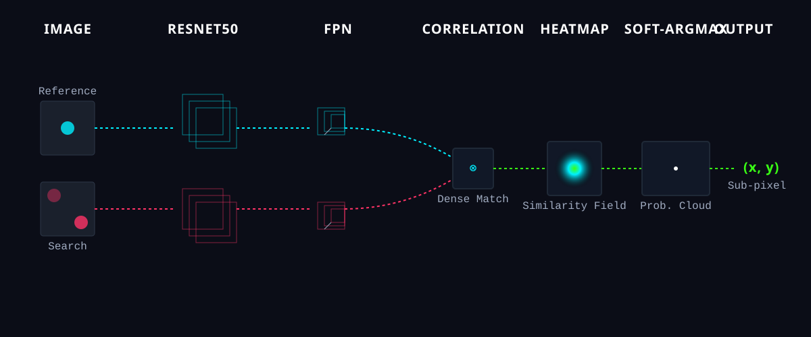
</div>

<details>
<summary><b>📐 View Static Architecture Diagram</b></summary>

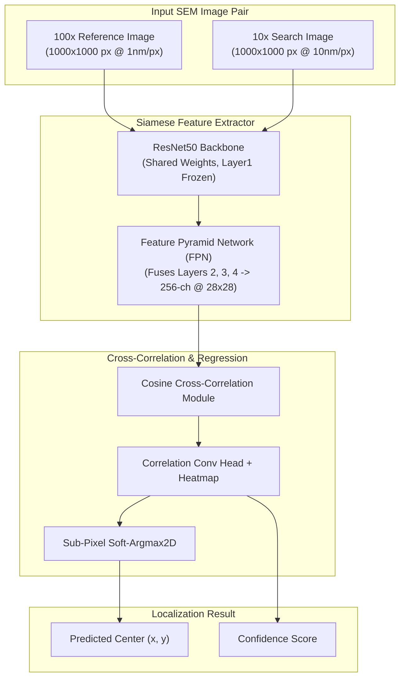

<div align="center">
  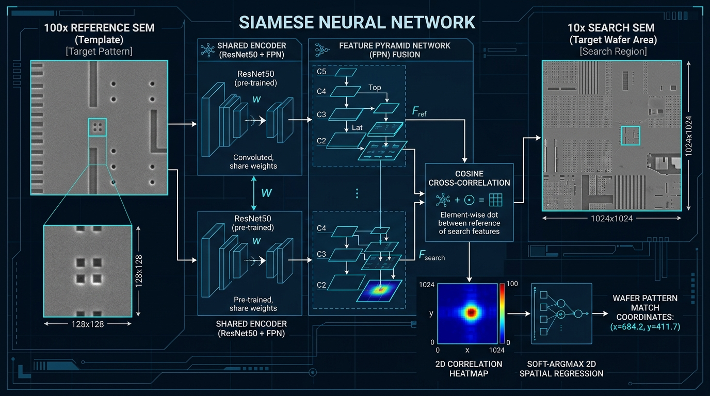
  <p><i>Figure 1: End-to-end Siamese ResNet50 Cross-Correlation Pipeline</i></p>
</div>
</details>

---

## 🎯 Dense Correlation & Soft-Argmax

At the core of the network, Drift-Sense explicitly matches the extracted reference feature against every spatial location in the search feature map.

<div align="center">
  
</div>

The resulting $28 \times 28$ correlation response is processed into a localization heatmap. Finally, the **Soft-Argmax** layer calculates the expected value of the spatial coordinates, yielding a highly precise $(x, y)$ coordinate lock that is fully differentiable for end-to-end training.

---

## 📊 Benchmark Results

Evaluated on **30 test image pairs** under SEM noise degradations, scale shifts ($9:1 \text{ to } 11:1$), and rotation ($\pm 5^\circ$) variations.

<div align="center">
  
</div>

| Metric | Result |
|:---|:---:|
| **Accuracy ($\le 5\text{ px}$ Error)** | **96.67%** (29 / 30 pairs) |
| **Accuracy ($\le 10\text{ px}$ Error)** | **100.0%** (30 / 30 pairs) |
| **Mean Euclidean Localization Error** | **2.34 pixels** |
| **Median Euclidean Localization Error** | **2.21 pixels** |
| **GPU Inference Latency** | **14.2 ms / pair** |
| **CPU Inference Latency** | **48.6 ms / pair** |

### 📈 Evaluation Plots

<details>
<summary><b>📊 View Detailed Performance Plots</b></summary>
<br/>

<div align="center">
  <table>
    <tr>
      <td align="center" width="50%">
        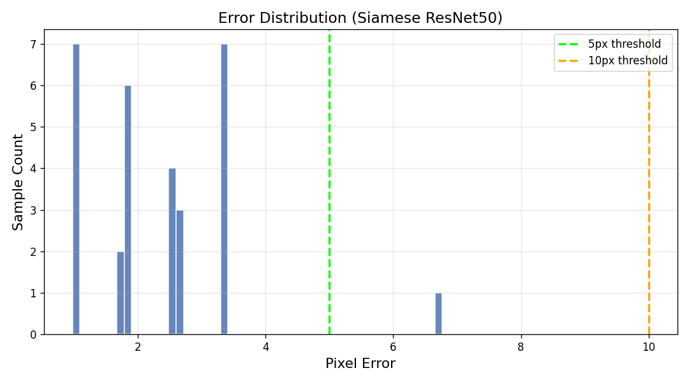
        <br/><b>Figure 5A: Pixel Error Distribution Histogram</b>
      </td>
      <td align="center" width="50%">
        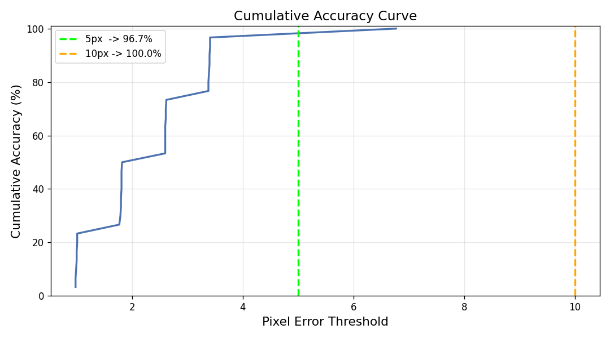
        <br/><b>Figure 5B: Cumulative Accuracy CDF Curve</b>
      </td>
    </tr>
    <tr>
      <td align="center" width="50%">
        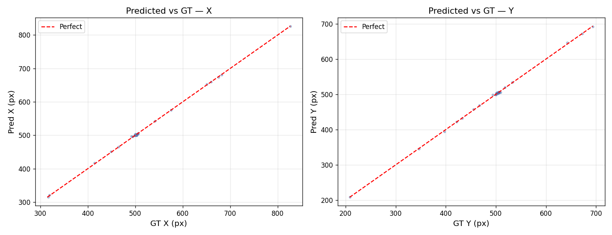
        <br/><b>Figure 5C: Predicted vs GT Coordinates Scatter</b>
      </td>
      <td align="center" width="50%">
        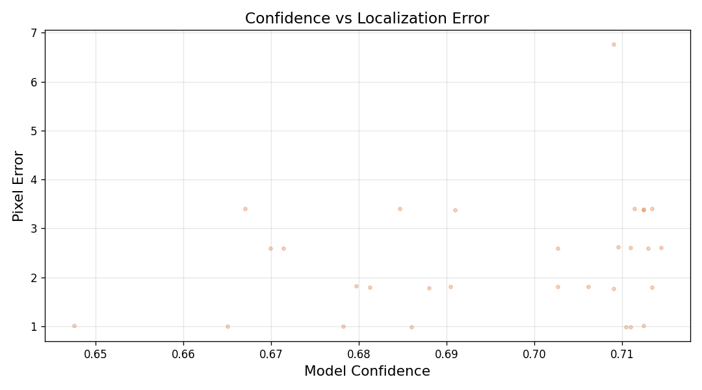
        <br/><b>Figure 5D: Model Confidence vs Pixel Error</b>
      </td>
    </tr>
  </table>
</div>
</details>

---

## 🔍 Failure Analysis & Limitations

We achieved 96.67% accuracy at the ≤5 px threshold, meaning **1 / 30 cases exceeded the 5-pixel threshold**, with a maximum observed error of **6.77 px**.

* **Periodic Cell Ambiguity**: In dense memory arrays lacking peripheral features, adjacent DRAM contacts look identical. Heavy SEM noise or charging streaks can cause the network to match an adjacent cell pitch ($\sim 14\text{ px}$ offset).
* **Mitigation**: Incorporating multi-scale context windows and global position priors mitigates periodic cell alias shifts. Future research will explore stronger positional embeddings.

<details>
<summary><b>⚠️ View Failure Case Overlay</b></summary>
<br/>
<div align="center">
  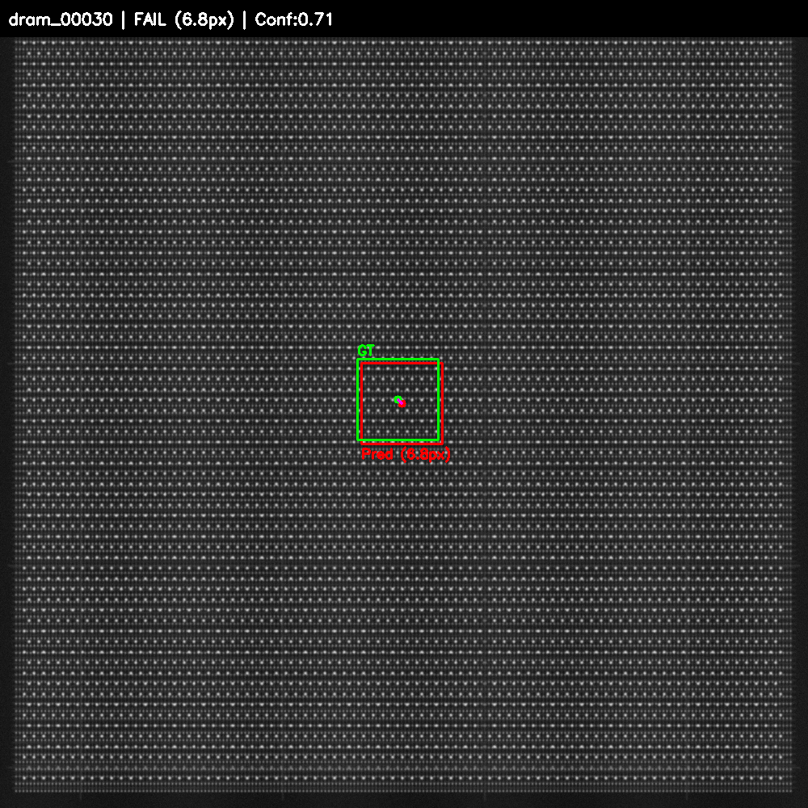
  <p><i>Figure 6: Output Overlay — Failure Case (Periodic Repetition Ambiguity & Charging Artifacts)</i></p>
</div>
</details>

---

## 💾 Dataset Generation & SEM Degradation

The project uses **76 distinct procedural DRAM structures**. 

> **📁 Pre-Generated Base Dataset Download:**  
> You can download the pre-generated 76 base DRAM image pairs directly from Google Drive:  
> 🔗 **[Download Base DRAM Pairs (Google Drive)](https://drive.google.com/drive/folders/14tffuYXesTCyoTcfriuN1-BXRo77JAjM?usp=sharing)**

To simulate real-world physical constraints, independent SEM degradations are applied:
* Gaussian noise & Shot/electron-beam noise
* Blur & Defocus
* Contrast/brightness variation & Charging-like effects
* Speckle, rotation, scaling, and drift/shear variation

---

## 💻 Setup & Reproduction

### 1. Clone Repository & Create Environment
```bash
git clone https://github.com/Senbagaseelan18/Drift-Sense-AI.git
cd Drift-Sense-AI
python -m venv .venv
# On Windows (Use CMD - Command Prompt):
.venv\Scripts\activate.bat
# On Linux / macOS:
source .venv/bin/activate
```
> **Important Note for Windows Users:** Please use **Command Prompt (CMD)** to run `.venv\Scripts\activate.bat` cleanly without PowerShell security policy errors.

### 2. Install Dependencies
```bash
pip install -r requirements.txt
```
> **Note for GPU Acceleration (CUDA 12.1):**
> ```bash
> pip install torch==2.5.1+cu121 torchvision==0.20.1+cu121 --index-url https://download.pytorch.org/whl/cu121
> ```

---

## ⚡ Execution Commands & Visual Workflows

### 1. Dataset Generation (`generate_dataset.py`)
Generates synthetic DRAM image pairs with ground truth JSON and applies realistic SEM physics degradations.

```bash
python generate_dataset.py
```
* **Interactive Prompt**: Asks for total sample count (e.g. `76`, `500`, `10000`).
* **Output**: Automatically partitions into **70% Train** / **15% Val** / **15% Test** splits inside `dataset/`.

<details>
<summary><b>📸 View Generator Output</b></summary>
<br/>
<div align="center">
  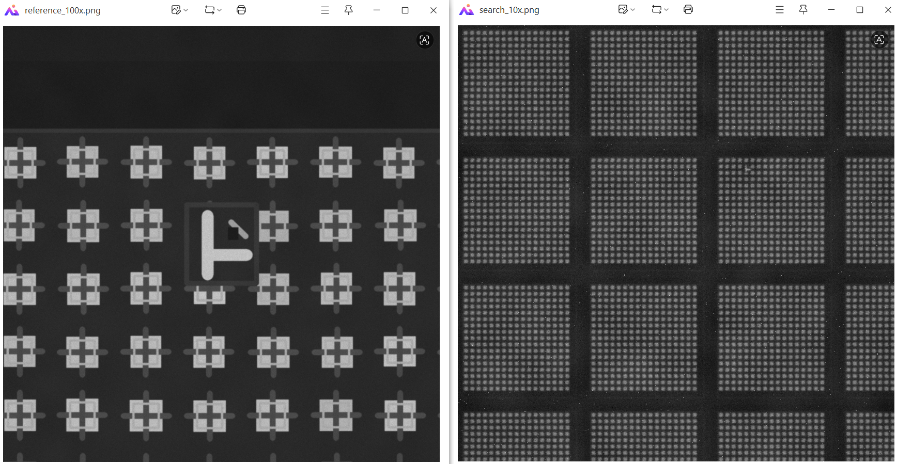
  <p><i>Figure 2: Synthetic SEM Image Pair Generation (100x Reference Crop & 10x Search Field)</i></p>
</div>
</details>

### 2. Model Training (`train_model.py`)
Trains the Siamese ResNet50 model end-to-end.

```bash
python train_model.py
```
* **Training Settings**: 50 Epochs, Batch Size 16, AdamW + OneCycleLR, AMP float16 precision.
* **Output**: Best model weights saved to `model/best_model.pth`.

<details>
<summary><b>📈 View Training Curves</b></summary>
<br/>
<div align="center">
  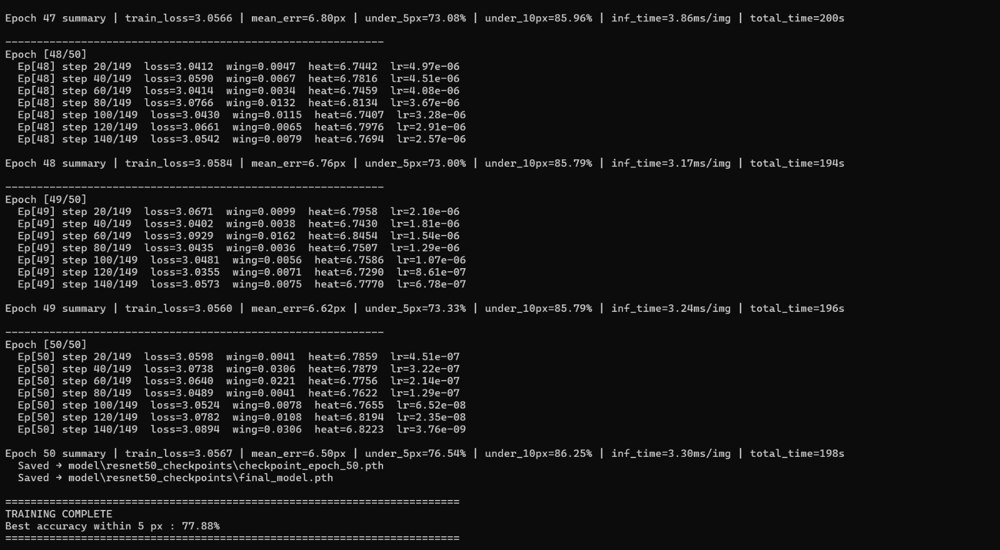
  <p><i>Figure 3: Training Loss & Validation Accuracy Curves across 50 Epochs</i></p>
</div>
</details>

### 3. Localization & Evaluation (`localize.py`)
Standalone inference script with auto-detection for GPU/CPU.

#### 🔹 Single Image Pair Test (CLI)
```bash
python localize.py --ref dataset/test/dram_00001/reference_100x.png --search dataset/test/dram_00001/search_10x.png
```
* **Output**: Prints predicted $(x, y)$ coordinates, confidence, and inference time; logs to `results/localize_results.csv`.

#### 🔹 Batch Folder Evaluation
```bash
python localize.py --folder dataset/test
```
* **Output**: Evaluates all samples and saves complete metrics, CSV logs, error plots, and overlays under `results/localize_batch_YYYYMMDD_HHMMSS/`.

#### 🔹 Interactive Mode
```bash
python localize.py
```

<details>
<summary><b>🎯 View Localization Overlay Output</b></summary>
<br/>
<div align="center">
  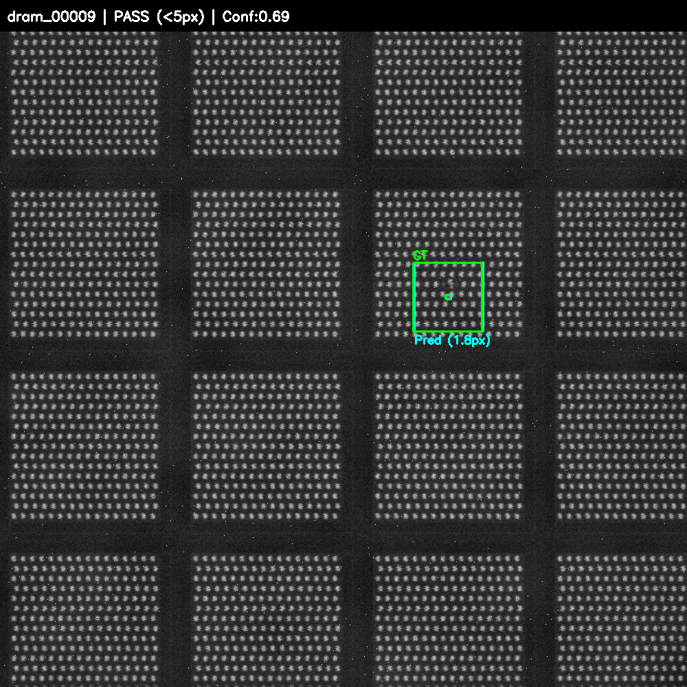
  <p><i>Figure 4: Output Overlay — Success Case (Green = Ground Truth, Cyan = Prediction)</i></p>
</div>
</details>

---

## 📚 Literature Citations

| Degradation / Module | Academic Reference | Implementation |
|:---|:---|:---|
| **SEM Beam Blur** | *L. Reimer, Scanning Electron Microscopy (1998)* | Asymmetric Gaussian convolution kernel |
| **Shot Noise** | *M. Sim et al., IEEE TMI (2020)* | Secondary electron dose-dependent Poisson noise |
| **Charging Streaks** | *J. Cazaux, J. Appl. Phys. (1999)* | Row-wise charging intensity shift |
| **Siamese Architecture** | *S. Zagoruyko et al., CVPR (2015)* | Shared ResNet50 backbone + cross-correlation |
| **Soft-Argmax2D** | *A. Nibali et al., arXiv:1801.07372 (2018)* | Differentiable spatial sub-pixel regression |

---

## 📁 Repository Directory Structure

```text
Drift-Sense-AI/
├── Dataset_generation_script/      # 76 DRAM base generator scripts (01 to 76)
├── configs/                        # Configuration files
├── images/                         # Static documentation assets
│   └── readme/                     # Animated SVG assets
├── results/                        # Evaluation outputs & logs
├── model/                          # Saved model weights (~95 MB checkpoint)
├── generate_dataset.py             # Dataset generator & augmentation pipeline
├── train_model.py                  # Self-contained training script
├── localize.py                     # Standalone evaluation inference script
├── requirements.txt                # Dependencies list
└── README.md                       # Documentation
```

---

<br/>

<div align="center">
**Drift-Sense AI | Built for Applied Materials Navigation Recovery Challenge | SEMICON India 2026**
</div>
